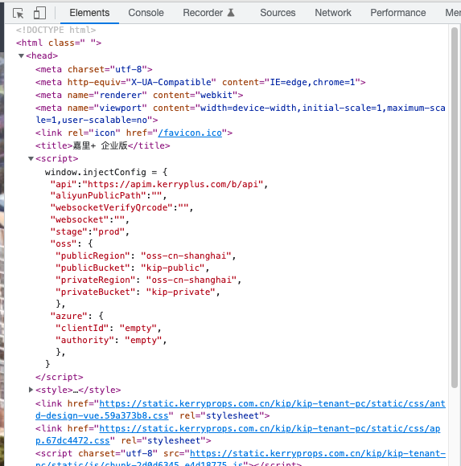

# vue-js-runtime-env

## Project setup
```
yarn install
```

### Compiles and hot-reloads for development
```
yarn serve
```

### Compiles and minifies for production
```
yarn build
```

## 运行时环境变量

目的：只打包一个 docker 镜像，可以部署到各个环境。

### 代码修改

看这个commit：[add window.injectConfig · joelz/vue-js-runtime-env@3a7e3ba](https://github.com/joelz/vue-js-runtime-env/commit/3a7e3ba9ce7c72334d28680361daceefdc4a951d)

打包出来的 docker 镜像在各个环境中运行时，`index.html` 中的 `// CONFIGURATIONS_PLACEHOLDER` 会被替换为 `window.injectConfig` 对象（系统工程师会帮忙编写脚本完成这个动作，不需要前端参与），类似这样：



### 参考文档

原理可以参考这篇文章：[Vue.js runtime environment variables | by José Silva | Vue.js Developers | Medium](https://medium.com/js-dojo/vue-js-runtime-environment-variables-807fa8f68665)。如果文章打不开，可以看我保存下来的pdf：[Vue.js runtime environment variables - Medium](./doc/Vue.js%20runtime%20environment%20variables%20Medium.pdf)